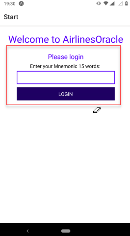

# AirlineOracle

The AirlineOracle is a mobile application which can be used on both established mobile operating systems - Android and iOS.
The App contents a gui and delivers a first approach, how an airline can store new flights inside its flightplan, create new inventories and can update the status of a flight. 
The detailed flight data is stored as a JSON data structure on the ipfs. Only the Content identifier (CID) and all relevant data, to query for, is stored on the smart contract.
The App uses the web3-API "ethers.js" (https://docs.ethers.io/). This API delivers 

## Login

Before a user can use the app, a login is required. To login, it is required to enter the own BIP39 Mnemonic. The ethers class "Wallet" takes the Mnemonic and creates the own private Key and the belonging address. Espacially the private key is necesary to sign all  messages before a transaction or a function call can happen.

