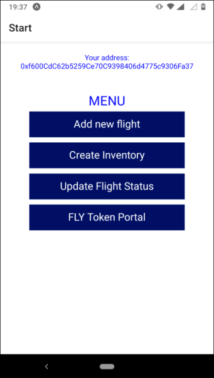
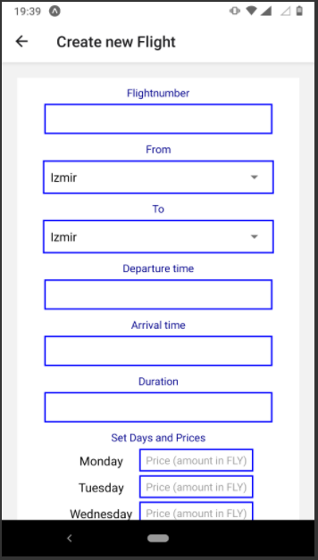

# AirlineOracle

The AirlineOracle is a mobile application which can be used on both established mobile operating systems - Android and iOS.
The App contents a gui and delivers a first approach, how an airline can store new flights inside its flightplan, create new inventories and can update the status of a flight. 
The detailed flight data is stored as a JSON data structure on the ipfs. Only the Content identifier (CID) and all relevant data for queries are stored on the smart contract.
The App uses the web3-API "ethers.js" (https://docs.ethers.io/). This API provides a library to build Wallets and interact with the blockchain.

## Login

The new Login method uses a BIP39 Mnemonic instead the username and password, from well-known applications. The ethers library provides the class "Wallet", which calculates the private key and is responsible for all interactions with the blockchain (smart contracts).

## Menu

The following print contents the main menu

## Create new Flight

To create a new Flight the user needs to fill out the form and sends the data to the contract ["OperationsPlan"](https://github.com/dedurak/smartcontracts/blob/main/smart_contracts/contracts/OperationPlan.sol) by pressing on the "Create Flight". 

-- TODO --
